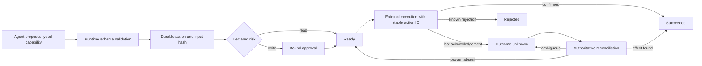

# Durable agent workflow safety core

**Status:** implemented synthetic TypeScript demonstration.

A small framework-neutral exercise showing how an internal agent can request and execute a consequential tool without giving the language model authority to bypass policy or blindly repeat an uncertain external effect.

## Scenario

An incident agent inspects a production deployment and proposes a rollback. Reads can run immediately. The rollback requires approval from a different identity, and the approval is bound to the exact validated payload. The control-plane connection may close after accepting the command, so the workflow must persist uncertainty, survive a process restart, and reconcile authoritative deployment state before it can finish or retry.

## Demonstrated outcome

- Register versioned capabilities with runtime-validated inputs and declared risk.
- Keep approval policy in deterministic code rather than model instructions.
- Permit read capabilities without approval while gating write capabilities.
- Bind time-limited approval to an immutable SHA-256 input fingerprint.
- Prevent requester self-approval in the demonstration policy.
- Persist action state before an external effect begins.
- Deduplicate identical action requests and reject changed payload reuse.
- Represent a lost acknowledgement as `OUTCOME_UNKNOWN`, not failure.
- Block blind retry until reconciliation confirms the effect or proves it absent.
- Restore an uncertain workflow from a durable snapshot without repeating the effect.
- Preserve an ordered, user-visible progress history.

## Architecture



The authority and uncertainty decision is documented in [ADR 0001](docs/0001-authority-and-unknown-outcomes.md).

For presentation, use the [two-minute walkthrough](WALKTHROUGH.md). Before any external release, use the [standalone publication checklist](PUBLICATION.md).

## Implemented stack

TypeScript, Node.js, Zod, Vitest, strict compiler options, deterministic clocks, an in-memory durable-store boundary, a scripted deployment control plane, and a structured executable walkthrough. No language model or framework is required because the safety properties live below the planning layer.

## Acceptance scenarios

1. Strict schemas reject an input that attempts to add `skipApproval`.
2. Read-only inspection executes without approval.
3. A write is blocked before approval, and the requester cannot self-approve.
4. Approval with a different payload fingerprint is rejected.
5. An identical action request is deduplicated; changed reuse is rejected.
6. An approved rollback executes once with ordered progress events.
7. An unknown but applied rollback is reconciled without a second execution.
8. An unknown and absent rollback can retry only after reconciliation evidence.
9. An unexpected external revision remains unresolved.
10. An unknown action survives store snapshot and coordinator restart.
11. An expired approval returns the write to `AWAITING_APPROVAL`.
12. Pending work can be cancelled, while completed work cannot.

## Run it

```bash
npm install
npm run verify
```

`verify` runs strict TypeScript checking, twelve automated tests, and a structured incident rollback walkthrough.

## Repository shape

```text
src/coordinator.ts             durable state machine, approvals, execution, reconciliation
src/deploymentCapabilities.ts  strict schemas and scripted external-system behavior
src/store.ts                   snapshot and progress-history persistence boundary
src/stableJson.ts              canonical payload fingerprinting
src/types.ts                   capability, action, approval, and outcome contracts
src/demo.ts                    restart and unknown-outcome walkthrough
test/                          twelve safety and recovery acceptance tests
docs/                          architecture decision record
WALKTHROUGH.md                 two-minute interview presentation script
PUBLICATION.md                 isolated public-release checklist
```

## Interview use

- Explain why tool selection is separate from authorization.
- Walk through approval binding and expiry.
- Show why a timeout after a write becomes `OUTCOME_UNKNOWN`.
- Demonstrate restart-safe reconciliation without a duplicate effect.
- Discuss replacing the in-memory store with a transactional database, outbox, leased workers, delegated identity, policy service, OpenTelemetry, and real target-system adapters.

## Production limitations

The store is a deterministic in-memory boundary with snapshot restoration, not a database. A production implementation needs transactional persistence and outbox delivery, concurrency fencing, worker leases, authenticated delegated identity, policy integration, encryption and redaction, secret isolation, real approval channels, version migration, OpenTelemetry, backpressure, rate limiting, and target-specific idempotency and reconciliation guarantees.

## Non-goals

No real deployment, account, credential, model, prompt, customer, or employer system is used. The incident and deployment data are synthetic. This is not a claim about any employer's private architecture and is not a production agent framework.
