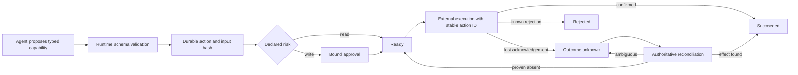

# Durable agent workflow safety

An internal agent can inspect a deployment and propose a rollback without the language model being able to skip approval or blindly repeat an uncertain external effect.

Portfolio project using fictional data. It is not connected to an employer, client, or production system.



Authority and uncertainty are recorded in [ADR 0001](docs/0001-authority-and-unknown-outcomes.md). No model or agent framework is required; the safety properties live below the planning layer.

## Capabilities

- Register versioned capabilities with runtime-validated inputs and declared risk. Extra fields such as `skipApproval` fail the schema.
- Keep approval policy in deterministic code. Reads run immediately; writes need a different identity.
- Bind a finite, time-limited approval to an immutable SHA-256 fingerprint of the plain JSON input.
- Persist action state before the external call. A lost acknowledgement is `OUTCOME_UNKNOWN`, not failure.
- Reconcile against action-and-attempt history plus authoritative current state before finishing or retrying, including after a process restart.

## Run

```bash
npm ci
npm run verify
```

`verify` runs strict TypeScript, seventeen tests, and a structured incident-rollback walkthrough (`src/demo.ts`). Node.js 22 is the CI runtime.

## Verification

GitHub Actions on push and pull request runs `npm ci`, `npm run verify`, and checks `MANIFEST.sha256` against `scripts/build-evidence-manifest.sh`.

The interesting cases: identity normalization cannot bypass separation of duties; an unknown but applied rollback is not executed twice; an unknown and absent rollback retries only after reconciliation evidence; an unexpected external revision stays unresolved.

## Design

- Requester and approver identities are normalized (whitespace, case, Unicode) before the self-approval check.
- Identical action requests are deduplicated. Reusing an action ID with a changed payload is rejected. Sparse arrays and non-JSON objects never enter the fingerprint.
- The stable action ID is the idempotency key passed to the scripted control plane.
- Pending work can be cancelled; completed work cannot. An expired approval returns the write to `AWAITING_APPROVAL`.

`src/coordinator.ts` is the state machine. `src/stableJson.ts` fingerprints payloads. `src/store.ts` is the snapshot/progress boundary. `src/deploymentCapabilities.ts` holds the schemas and the scripted control plane.

## Limitations

In-memory snapshot store, scripted deployment adapter, no real identity provider. See [LIMITATIONS.md](LIMITATIONS.md).
